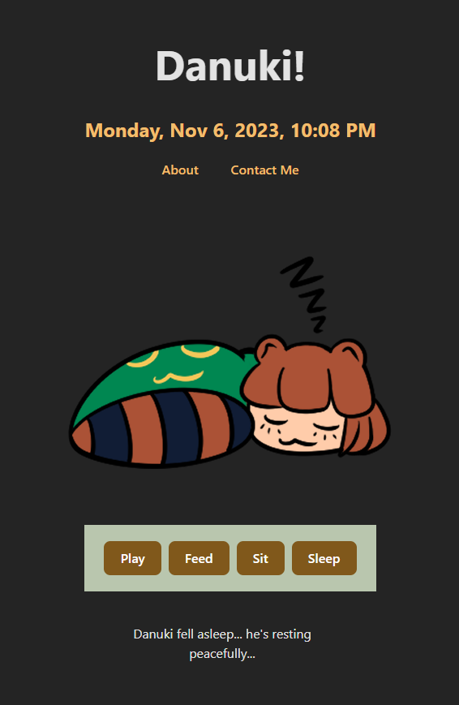

#  Tamagotchi-Project-Marcos-Wang

## Link to Deployed Application:

https://danuki-tamagotchi-c97dce4fa37b.herokuapp.com/

## User Story

```
AS Someone working on the computer for hours
I WANT to have a little online buddy
SO THAT I can keep my mood up through a long work day
```

## Technologies Used

HTML

CSS

Javascript

React

Vite

## License

MIT License, please refer to the license in the repository.

## Technical Requirements

> Use React for the front end.
>
> Use a Node.js and Express.js server.
>
> Be deployed using Heroku.
>
> Have a polished UI.
>
> Be responsive.
>
> Be interactive (i.e., accept and respond to user input).
>
> Protect sensitive API key information on the server.
>
> Have a clean repository that meets quality coding standards (file structure, naming conventions, best practices for class and id naming conventions, indentation, high-quality comments, etc.).
>
> Have a high-quality README (with unique name, description, technologies used, screenshot, and link to deployed application).

# Mockup



##

<a target="_blank" href="https://icons8.com/icon/18066/leaf">Leaf</a> icon by <a target="_blank" href="https://icons8.com">Icons8</a>

[Stock background image](https://unsplash.com/photos/trees-on-forest-with-sun-rays-sp-p7uuT0tw) provided by [Unsplash](https://unsplash.com) and taken by Sebastian Unrau.